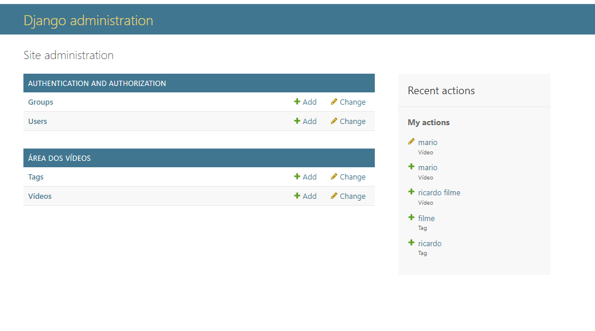
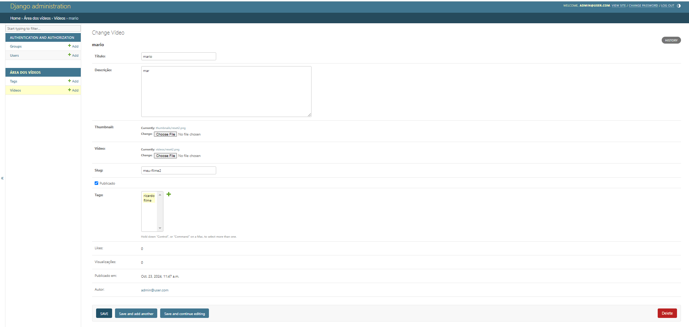

# Administrative area using Django

This repo is based on the youtube tutorial [Django: Crie Aplicações e Áreas Administrativas em Minutos](https://www.youtube.com/live/bupRIZrXySk)

## Functionalities
- CRUD of video and tags
- Fields read only
- Video filter and search
- Sort
- Video properties
  - Title
  - Description
  - Thumbnail image
  - Video
  - Slug
  - Published
  - Multiple tags
  - Likes and views counter
  - Published at
  - Author (logged user)

## Tecnologies used
- Python 3.12
- Django 5.1.2
- Docker

## How to run
- Clone the repo
- Start Docker
- Create the venv `python -m venv venv`
- Activate env `.\venv\Scripts\activate`
- Install the requirements `pip install -r requirements.txt`
- Start container `docker compose up`
- Ubdate database `python manage.py migrate`
- Start server `python manage.py runserver`
- Access http://127.0.0.1:8000/admin
- User: admin@user.com  password: 123456

